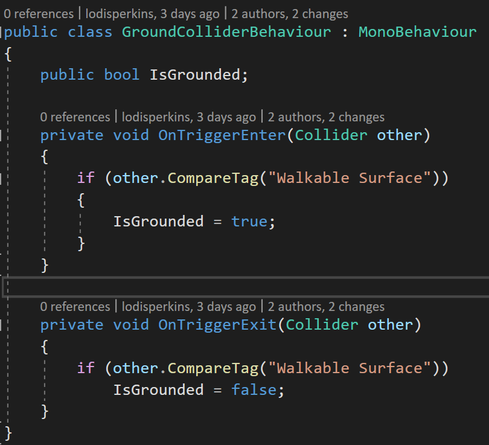
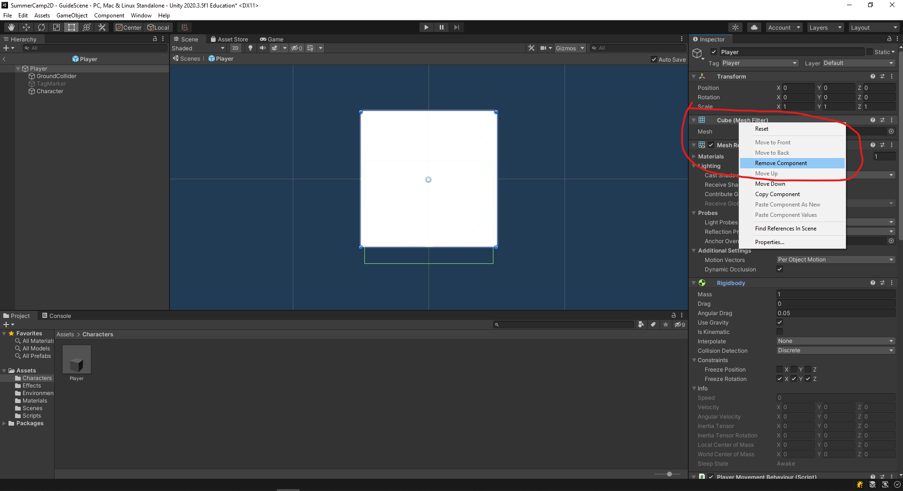
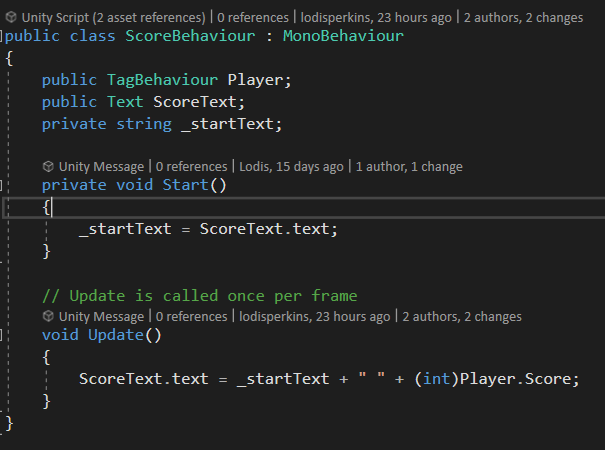

# Creating Player Movement
To start, create a platform for the player to walk on. To add a game object to the scene, either right-click or click the plus icon in the hierarchy window and select 3D object -> cube. Name this cube "Floor". 

Next, we'll increase the size of the cube to give our player more room to move around. If an object or asset is selected, the inspector window will display all of its properties. At the top of the inspector, there is a component labeled Transform. Set the x axis value for scale to be 25.  

Now that we have a platform, we can add our player to the scene. Create another cube, this time name it "Player". Set the y value for position in the inspector to be 1 so that our player doesn't spawn in the floor.

For our movement, we're going to want our player to be able to run, jump, and be affected by other objects in the scene. In order to do all of these things, we'll need our player to have physics. To give an object physics, we'll need to attach a Rigidbody. To add a component to a game object, select the "Add Component" button in the bottom of the inspector. We can then search for the component we want to add. Search for "Rigidbody" and select it to add the component to our player.

To test things out, place the player a bit higher in the scene and press the play button. You should see that our player now has gravity!

Now that we have physics, we can create a script that can move our player by adding forces. First, create a folder to hold all of our scripts by right clicking in the project window and selecting Create -> Folder. You can name this folder "Scripts". In the Scripts folder, right-click and create a new C# script by selecting Create -> C# Script. Double-click the script to open it in Visual Studio and add the following code:

This code contains a variable called "_rigidBody" which will store the physics component. Note that the variable has the word "private" in front of it. A private variable can only be used only in the script it's created in, while a public variable can be used anywhere. Public variables can be seen in the inpector of the object the script is attached to. This will be useful for other variables later on. The "Start" function is called when the game object is placed in the scene. We'll use this function to make our "_rigidBody" variable store the Rigidbody component we added earlier. We can use this to add a force to the player every frame. For now, we'll just add a force to the right. For reasons outside the scope of this tutorial, we'll have to change our "Update" function to be a "FixedUpdate" function to ensure our physics works correctly. Back in Unity, attach the movement script to the player in the same way you added the Rigidbody component earlier. If you play the game now, you'll see our player being pushed to the right with a lot of force.

We can address this weird movement by making some changes to our script. First, a new variable is created that can control the acceleration of the character called "Acceleration". The variable can then be multiplied by the direction of movement to set how quickly the player moves in that direction. This value is then multiplied by "Time.fixedDeltaTime" to make the movement smoother. A variable is also created to set a max speed. If the player exceeds the max speed, their speed is reduced to be the max speed.

Back in the editor, set the acceleration and max speed to be what feels right. For this example my acceleration will be set to 30 while my max speed will be set to 60. Play the game again, and you should that the movement is smoother, but our player is still rolling. 

To prevent our player from rotating, we can lock its rotation in the Rigidbody component in the player's inspector. Expand the "Contraints" section, and check freeze rotation on the x, y and z axis. 

# Adding Movement Input

Our movement is working as intended, but our player has no way of controlling the cube's movement. Acceleration and speed is already handled in code, so we'll just need to add a way for our player to decide which direction to move in. 

In the code above, a new variable is added to store the current direction of movement. That variable will be set in the "SetMoveDirection" function. Note that the "public" keyword is before the function. By default, things in C# are set to private. Having the function set to public allows the move direction to be set by the script for input. Speaking of, create a new script in Unity called "InputBehaviour" and add the following code: 

The variable "_playerMovement" stores the player movement component. This is so that we can easily update the move direction. In the "Update" function, the direction the player's character should move in is set to be the direction of the current value of the "Horizontal" input axis. By default, the keys bound to this axis are A or the left arrow to move left, and D or the right arrow to move right. Add the component to the player object in Unity, and you will be able to make your player move left and right.

# Adding Jumping

Our game of tag would be over pretty quick if we were only able to move in one dimension. In the current state of the game it would be impossible to avoid the tagger. We can make things more interesting by adding some verticality to our game. To do this we'll have to update the movement script with the following code:

Here we've added a new variable to control how much force is exerted on our player when they jump. This force will only be added if the "Jump" function called. The force mode for the jump will be an impulse force. An impulse force adds an instant force to the character using its mass.

Now that the player character has the ability to jump, it's time to set up the input for activating the jump. Unlike movement there isn't a default input axis set up for jumping. Instead, we can simply add a check to see if the "W" key was pressed like so

Back in the Unity editor, change the jump power to be something that feels right for your game. For this example I'll set mine to 14. Play the scene, and your player will now be able to jump using the "W" key. The only problem is that or player can jump infinitely.

To fix this, we need a way to check to see if our player is on the ground before they jump. There's several ways to check to see if a character is grounded. The common method that we will use is to create a collider to check if the character is colliding with the floor. Add a new cube to our player object. Set the cube's position on the y axis to be -0.1. We want the collider to barely stick out from under the player so that they aren't allowed to jump until they are close to the ground. 

We only need this object to check if we are on the ground, so we'll need to modify its components. First, disable the "MeshRenderer" component so we aren't able to see the ground collider. You can disable it by clicking the check box in the top left of the component in the inspector window. 

The ground collider shouldn't have solid collision. If it did it would look like our player is floating. To remove the solid collision, check the "Is Trigger" checkbox in the Box Collider component.

We'll now need a way to determine whether or not the ground collider is colliding with a walkable surface. To do this, we'll need to label objects in the scene as being walkable objects. Luckily, Unity has a built in system that allows us to give objects labels or "Tags" with ease.

Select the "Floor" game object in the scene. In the top of the inspector window, you should see a value called "Tag" with a dropdown box.
By default, everything is marked as "Untagged" or not labeled. To change  the label, click the dropdown box.  

As you can see, Unity comes with some default tags. None of these will be useful to us. Select "Add Tag" to create a new custom tag. This will bring you to the "Tags & Layers" section. Click the plus icon under "Tags" and name the new tag "Walkable Surface".

Create a new script, name it "GroundColliderBehaviour", and add the following code:

Here we have created a variable that will store whether or not the character is on the ground. Then we set up our collision functions so that whenever a walkable surface enters our trigger, "IsGrounded" is set to true, and when it leaves our trigger, it is set to false. In other words, the player is only considered on the ground if it is touching something labeled as the ground.

Go back to the player movement script and update to look like this:

Our script has now been updated to include a variable that can store the ground collider. It also includes a check to see if the player is grounded before they are allowed to jump. Go back into Unity and attach the "GroundColliderBehaviour" script to our ground collider object. Afterwards, drag the ground collider object into the slot that says "Ground Collider" on the player's movement component. Play the game, and you'll see that our player now only jumps when they are on the ground.

# Adding Multiplayer

Now that we have our player done, we can start actually creating a game of tag. Tag is a game that requires a minimum of two players, so the first thing we'll need to do is duplicate our player. We could simply copy and paste our current player, but that would mean that any changes we wanted to make to player 1, we would have to remember to also make those changes for player 2. This could easily lead to mistakes during later development.

Fortunately Unity has a feature that allows us to easily make a copy of our player, and we only have to make changes in one place. To do this we would have to make our player a prefab. You can think of a prefab as a blueprint for the player. It defines the basic building blocks that all players have, while also allowing us to make changes to players in the scene that make them unique. 

Create a new folder and name it "Characters". To make the player a prefab, drag the player from the hierarchy window into the folder. Drag our new prefab into the scene to make a new copy of the player. Name this object "Player2". 

If we were to play the game now, we would be controlling both players at once. We can solve this by updating our input system. To do this we'll first need to add controls for player 2. Go to "Edit -> Project Settings -> Input Manager" to view the current input axis set up. Expand the second option that says "Horizontal". Rename the axis to "Horizontal2", set its positive and negative buttons to "left" and "right" respectively, and set the type to be "Key or Mouse Button".

Now we'll just need to update our input script so that it can change the inputs to accept based on the player. Update your script so that it looks like the following:

We've added a new variable to act as a label for our player. We then updated our input calls so that it changes the buttons required for input based on the player number. If the game object this script is attached to is player 1, we will use default controls. Otherwise if the game object is player 2, we will use player 2 controls. 

Back in Unity, change the "Player Num" variable on the input script for player 1 and player 2 to be "1" and "2" respectively. Afterwards, play the game to test out the controls. You will now be able to control the second player using the arrow keys.

# Adding Tagging

Creating a tag system is pretty simple: all we'll need to do is keep track of who is "it" and transfer that label to the other player when they collide. If we were to follow standard tag rules, our game could potentially get unfair at times. Imagine player 1 is the tagger and collides with player 2. Now in this case we should set player 2 to be the new tagger and it will be first player's turn to run. Since the players are still close to each other in this example, it could be difficult for player 1 to be able to put distance between themselves and player 2. There are few way to address this, like adding an invincibility timer, but it would be easier to set a spawn point for our players on the level. After a player is tagged, we'll teleport them back to the spawn point. 

In the hierarchy tab add select the plus icon and choose "Create Empty". Name this object "Spawn Point". You can place your spawn point where you like, just be sure it's above the platform.

Since our object is empty, it will be difficult to keep track of it in our scene. We can fix this by adding an icon to our game object. With the spawn point selected, click the cube in the top left corner of the inspector and select an icon; any icon will do. 

In our code, we'll need to be able to tell if the object a player is touching is another player. So let's create a new tag called "Player" and add it to the player prefab just as we did with the ground. Now we can create a new script that can keep track of who's the tagger, and send the tagged player to the spawn point. Create a new script in the "Scripts" folder and call it "TagBehaviour". Add the following code to the script:

First we create three variables: a transform to store a reference to the spawn point, a boolean to store whether or not this player is the tagger, and a float to keep track of how long the game should wait before respawning a player. By default, we can set the spawn delay to be 3 seconds.

We can use Unity's "OnCollisionEnter" function to run code when this player collides with an object. If the object the player collided with isn't another player, it's not important, so we'll use the return keyword to exit the function. If the object is a player, we need to update this player's "IsTagger" boolean. If we touched a player while it was the tagger, then it's the other player's turn to be the tagger, so "IsTagger" is set to false. Otherwise, if this player wasn't the tagger, it must have gotten caught by the tagger, so we set "IsTagger" to true.

We'll need to create a function to respawn the player. In this function, we'll be set the player position to the position of the spawn point. We'll call this function if the player has been set to be the new tagger. It would be nice if this spawn had a bit of a delay to give both players a chance to breathe. To do this, we can use Unity's "Invoke" function. This function calls a function that matches the name we give after a certain amount of time has passed. We'll have this function call the "Respawn" function after the time for the spawn delay has passed.

Back in Unity, add a "TagBehaviour" script to the player prefab we created. This should add the script to both players in the scene. For both playes currently in the scene, drag the spawn point we created earlier into the "Spawn Point" slot on the script. Underneath that slot, you should see the "IsTagger" boolean we created. Check this for the player that you want to be the tagger first. Now if you play, you should see that we can finally play tag!

# Making an Interesting Scene

Our main game loop is complete, but our game is pretty plain in terms of scenery. To start, lets add some color to our scene. We can give objects different colors by creating "Materials". Create a new folder in the project tab and name it "Materials". Right click in this folder and select "Create -> Material". Name this material "Player1Mat". Click on the material and you should see its properties in the inspector window. By default, materials in our scene are effected by lighting. In our simple game, we don't really need realistic lighting. At the top of the inpector select the "Shader" drop down menu. From here, select "Unlit -> Color". You can choose the whatever color you like. To apply the material, simply drag it on to player 1. Do the same for the ground and the second player.

We can also change the color of our background from being the default blue. Select the "Main Camera" game object in the hierarchy. In the inspector, you should see a section called "Background". You can change the color here to match your game. There is also a section underneath called "Size". This increases the area that our camera can see. We can tweak this to zoom out or in to our scene. 

Now it's time to build our level. The level layout can be whatever you want it to be. You can make new platforms and walls the same way we created our floor. Just be sure that surfaces you want the player to be able to walk and jump on are given the "Floor" tag. Otherwise you could prevent player movement on certain platforms. Here's what my level looks like in the scene view and the game view:

# Making Smoother Movement

Right now the movement in our game feels sticky. This is partly due to the shape of our characters and the amount of air control our player has. Lets address the shape problem first. The square shape for our player makes it hard to accelerate and make it up to platforms. So does this mean we need to change the shape of our player? Well yes and no. When it comes to collisions in game development, we always want to prioritize game feel over accuracy. In other words, our hit boxes don't need to be completely accurate if it allows the player to have more fun. So we'll make the collider for the player a circle while keeping the shape of our player character a square. 

The first thing we want to do is remove the cube visuals from the top level of our player prefab. Open up the player prefab and remove the "Mesh Renderer", "Cube(MeshFilter)", and the "Box Collider" components. You can remove a component by right clicking it and selecting "Remove Component". Now add a "Sphere Collider" component to the player instead. Making the collider a sphere instead of a box will make it a lot easier for the player to get on platforms since they have to be less precise with their jumps. It will also make jumping again after landing on a platform feel a bit more responsive. 

Click the plus icon in the hierarchy and add a new cube to the "Player" game object. You can name this cube "Character". This will be the visual representation of our player that won't handle collision. Remove the "Box Collider" component from the cube. You may also need to adjust the ground collider so that our grounded check isn't too generous. If you play the game now, you should notice a huge difference in how the movement feels.

Next, lets address the players tremendous air speed. If our player holds the direction they jumped in, they can still accelerate while not being affected by friction. This makes it to where our player can travel at high speeds easily in air. We can fix this by adding the following changes to our movement script:

Here we've added a new float to keep track of how much we want to reduce the the acceleration. If the player is not on the ground, we reduce the acceleration value by our set amount. You can tweak this number as you see fit. The higher the number, the more "weight" your jump will have.

# Creating UI

Let's create a score counter for our game. We'll have the score measure how long each player can survive by having the score increase while they aren't the tagger. Click on the plus icon in the hierarchy tab and select "UI -> Canvas". The canvas is a game object that will be overlayed on our camera and contain all of our UI objects. 

Add a textbox to our canvas by right clicking on it and selecting "UI -> Text". Name the text box "P1ScoreText". Right now the text is a bit small. We can increase the size of our font by increasing the value in the "Font Size" section in the inspector window. Set the font size to 33. The text should now disappear. This is because the text is now too big to fit in the text box. We can adjust the width and height of the textbox in the "Rect Transform" component in the inpector. Set the width to 400 and the height to 55. Now we'll be able to view our large text. You can change the text in the textbox by type under the "Text" section in the inspector. Change the text to read "P1 Score: ". You can change the color of the text in the "Text" component in the inspector.

Now we just need to position the textbox. I think it would nice if it was in the top left corner. We could just drag the textbox to the position we want, but there's a more precise way to adjust the position. At the top left of the "Rect Transform" component there should be a square with the words "middle" and "center" around it. This is called an anchor. We can use this to set the origin and the position of our UI element. Click on the square and select the "Top Left" option while holding down the "Alt" key. 

Our text box will now move to the top left corner of the canvas. Setting the anchor also ensures that our textbox will always stay in the same position regardless of the aspect ratio. We'll need to repeat the same steps for player 2's score counter. This time, you'll want to change the anchor to be in the top right.

Now we'll need to update our tag script so that it keeps track of the score. Add the following code to "TagBehaviour":

We need to add two new variables: one to keep track of our current score, and one to keep track of the amount our score will increase by. We'll then use Unity's update function to check to see if the player isn't the tagger. If they aren't the tagger, we'll increase the score. The "Time.deltaTime" variable is there to ensure our counter counts smoothly instead of rapidly.

Create a new script called "ScoreBehaviour" and add the following code:

The score script will store a reference to the "TagBehaviour" of the player that it's keeping score for. We don't want to overwrite the text that is already in the textbox. If we did, our textbox would only display the score count without labeling it as such. To prevent this from happening, we'll store the starting text in a variable. We'll then just update the textbox text to be a combination of the start text and the score count.

Back in Unity, attach the new script to both of the textboxes we created. Drag the player whose score the textbox should display in the "Player" slot. Then drag the textbox game object into the "ScoreText" slot. If you play the game now, you should see that a player's score increases when they are not the tagger.

It would be nice if our players were able to tell who was the tagger visually. As we have it now, players must remember who the tagger is on their own. We don't have to make a big fancy UI element for this. To show who the tagger is, we'll simply add a game object that hovers over the characters head.

Open the player prefab, and create a new sphere in the hierarchy tab and name it "TagMarker". Set the scale of the sphere to be 0.6 on all axis. Next set the position of the sphere to be 1 on the 1 axis. Let's also create a material for the tag marker so we can change its color. Create a new material like we did before that has a Unlit/Color shader applied. Set the color to be whatever you like. For this example. I'm going to make my marker yellow.

Once the tag marker material is applied, set the tag marker object to be inactive in the inspector. You can do that by clicking on the checkbox in the top left corner of the inspector tab. 

We only want our tag marker to appear over the player that is currently the tagger. Because of this, we'll need to turn the marker off by default and turn it on in code. Update the "OnCollisionEnter" function in the TagBehaviour script with the following code:

There isn't too much to add here. All we have to do is create a variable to store the tag marker. Once we have that variable, we can use the "SetActive" function turn the object on or off based on whether or not the player is the tagger. Back in Unity, open the player prefab and drag and drop the tag marker into the tag marker slot. In your active scene, make the tag marker for the player that should start of as the tagger active in the scene by clicking the checkbox in the top left of the inspector. If you play the game now, you should see that our players now have a marker above their heads when they are the tagger.

# Adding Effects

Our game is looking pretty good! We can take this a step further though by adding some effects. To start we'll make a trail extend from the player while moving. To add a trail easily to objects in Unity, we just need to add a "TrailRenderer" component. Add this component to the player prefab. At the top of the component should be a graph called "Width". This controls the width of the trail over time. For this, I think it would be nice if our trail started wide and narrowed as it progressed. To do this, we'll need to add another key. To add a key at the end, right click on the end of the width line and select add key.

Once the key is added, click and hold to drag it all the way down. This should give us a nice curve from start to end.

Now that we have the width sorted out, lets tweak the length. We're going to want to specify how long pieces of our trail should stick around for. We can tweak this by modifying the "Time" variable directly underneath the graph. You can make this number whatever you like. Just remember that the longer the value, the longer your trail will be. I'm going to set mine to 0.3.

Go back to our players in the scene and select one. Now we'll edit the color so that the trail is unique for both players. Click on the "Color" section in the trail renderer component. This will open the gradient editor. 

We don't have to pick a fixed color for our trail. The gradient editor makes it really easy to change the color of our trail from the start to the end. The top two knotches control the transparency over time, while the bottom two notches control the color over time. For my player 1 character, I want their trail to start red and fade out into orange. To do this, I'll first need to set the starting color. To set the starting color, click the first knotch on the bottom and then select the "Color" section underneath it. After changing the color, it should give you something that looks like this:

Now our trail will start red, but gradually transition to white. To change the end color, we just need to do the same thing for the last knotch on the bottom. I also want the trail to fade out at the end, so I'm going to adjust the last knotch at the top. The color option should now change to an alpha slider. I'm going to set my alpha at the end to 150, but this can be whatever you want it to be. Repeat the same steps with the other player, but give them a unique color.

Now lets add an effect for when a player gets caught. We don't have any art assets, but there's a very simple way we can make something that resembles an explosion. We'll be using a technique that's used a lot in Vlambeer games. The way some of their games ([like UltraBugs](https://www.youtube.com/watch?v=eH5EfVCgHYM&ab_channel=VentureBeat)) make an explosion is by simply spawning a black circle, and then spawning a larger white circle. That combined with good camera shake is enough to sell an explosion. We'll be able to replicate this using a particle system. 

Right click in the hierarchy tab and select "Effects -> Particle System". The particle system likely won't spawn at the origin and will be rotated. Right click on the component that says "Transform"  in the inspector and select "Reset" to change its values to the default. Under the transform component, you should see the component to modify the particle system. Make the following modifications to the component:

 - Change the duration to be 1 second instead of 5. This will make our particle emitter play for a short amount of time.
 - Turn off "Looping" so that the explosion only spawns once.
 - Change the lifetime to be 0.2. This is so that the particles that are spawned die out quickly.
 - Change the start speed to 0. This will make our particles stand still when they are spawned.
 - Set the start size of the particle to 10. A larger particles size will make our explosion easier to notice.
 - Set the simulation speed to 2 so that the explosion spawns and dies quickly. 
 - Under the emission section, change the rate over time to be 0. This limit the amount of particles that will be generated over time. Below, add a new burst by clicking the plus button. This will make one particle burst out.
 - Check the "Color over Lifetime" section to make the color of the particle change over time. Part of the reason this works as an explosion is the contrast of color. Click on the color to open the gradient editor. Select the drop down in the top right, and change the mode from blend to fixed. Click on the tick in the bottom left corner of the color bar. Change the location of the tick to be at 50%. Now change the color of the tick to be black. 
 - Enable the "Size over Lifetime" section. We don't need to modify anything here since the sizes increases linearly already.

 
